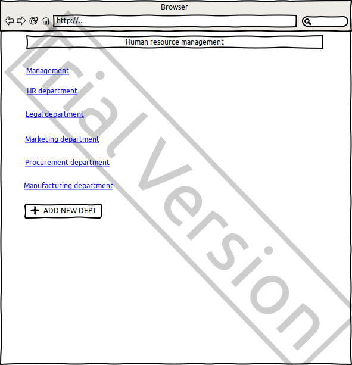
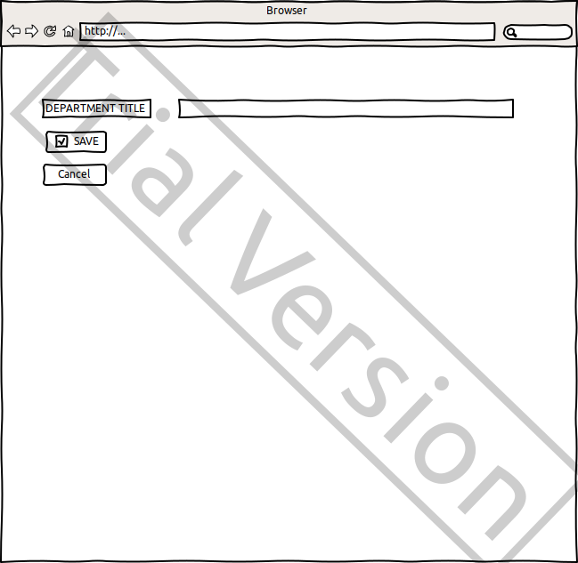
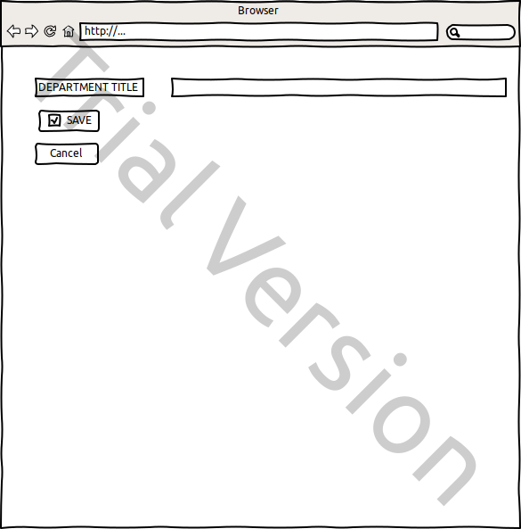
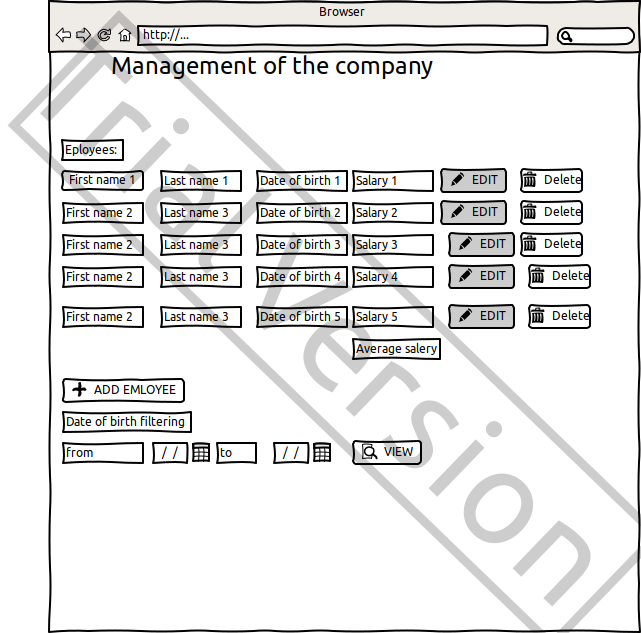
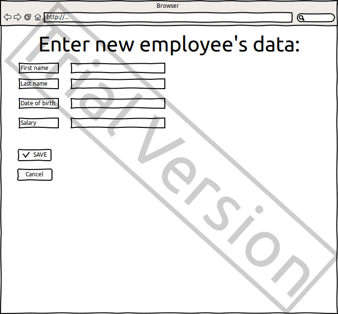
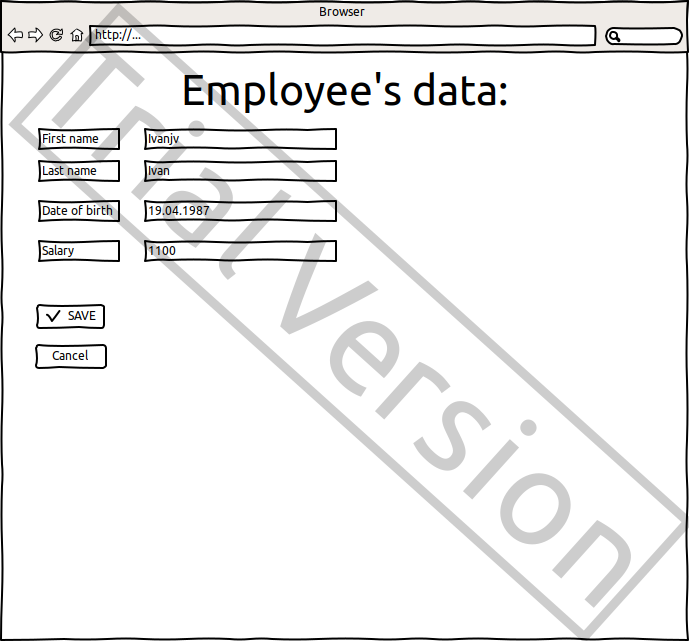

# Human resource management web application

Application should provide:

- Storing departments and employees in a database;
- Display a list of departments and the average salary for each department;
- Display a list of employees with an indication of the employee's salary;
- Searching employees born on a certain date or in the period between dates;
- Updating a list of employees (adding, editing, removing);
- Updating a list of departments (adding, editing, removing).

## Departments
### Display a list of departments

The mode is designed to view a list of departments, average salary of departments, and also edit the department's info.

#### Add department
#### Main scenario:

- User clicks the “ADD NEW DEPT” button in the list of departments view mode;
- Application displays form to enter department's title;
- User enters department's title and presses “Save” button;
- New department record is successfully added, then the list of departments with added record is displaying.

#### Cancel operation scenario:

- User clicks the “ADD NEW DEPT” button in the list of departments view mode;
- Application displays form to enter department's title;
- User enters department's title and presses “Cancel” button;
- Data don’t save in database, then user is redirected to the list of departments.  

#### "Delete DEPT" button

"Delete DEPT" button redirects user to main page with the list of departments without deleted department. 
All records about employees of this department have been removed from the database. 

#### "EDIT DEPT" button

"EDIT DEPT" button redirects user to edit form:

#### Main scenario:

- Application displays form to edit department's title;
- User enters department's title and presses “Save” button;
- New department's title is successfully saved, then user is redirected to the list of employees of edited department,  
where it's new title is displaying.  

#### Cancel operation scenario:

- Application displays form to edit department's title;
- User enters department's title and presses “Cancel” button;
- The title don’t saved in database, then user is redirected to the list of employees of the department.  

## Employees
### Display list of employees

This mode is intended for viewing, filtering employees born on a certain date or in the period between dates and also  
editing the list of employees of current department.

#### "VIEW" button
#### Main scenario:

- In the list of employees view mode user sets filtering conditions and presses the "VIEW" button; 
- The application will show employees whose dates of birth fall within the specified period in a separate window;
- if the beginning and end of the period are the same, then the application will show employees with the date of birth  
on the day specified by the user.
- pressing the back button will return to the screen with employees list;
- if the user enters the search interval, but does not click on "VIEW" button, then the filtering will not start, the  
entire list of employees will be displayed on the screen

  

#### "ADD EMPLOYEE" button 

"ADD EMPLOYEE" button redirects user to post form:

#### Main scenario:

- Application displays form to enter employee's data;
- User introduces employee's first name, last name, date of birth, salary; 
- User clicks the “SAVE” button; 
- New employee's record is successfully saved, then user is redirected to the list of employees of edited department,  
where new employee's data and new department's average salary is displaying.

Aggregate function of department's average salary: Average salary = Total salary / Number of employee  

#### Cancel operation scenario:

- Application displays form to enter employee's data; 
- User introduces employee's first name, last name, date of birth, salary;
- User presses “Cancel” button;
- Employee's data don’t save in database, then user is redirected to the list of employees of the department.

#### "Delete" button

"Delete" button redirects user to the webpage of running department with the list of employees without deleted
employee.  

#### "EDIT" button

"EDIT" button redirects user to employee's edit form:

#### Main scenario:

- Application displays form to edit employee's data; 
- User edit employee's first name or last name or date of birth or salary; 
- User clicks the “SAVE” button; 
- New employee's data is successfully saved, then user is redirected to the list of employees of employee's department,  
where new employee's data and new department's average salary is displaying.

#### Cancel operation scenario:

- Application displays form to edit employee's data; 
- User edit employee's first name or last name or date of birth or salary; 
- User clicks the “Cancel” button; 
- Employee's data don’t save in database, then user is redirected to the list of employees of the department.