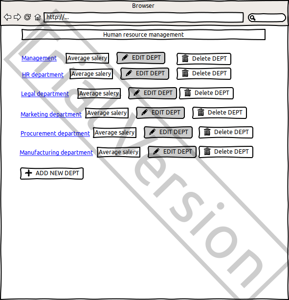

# Human resource management web application

Application should provide:

-Storing departments and employees in a database;
-Display a list of departments and the average salary for each department;
-Display a list of employees with an indication of the employee's salary;
-Searching employees born on a certain date or in the period between dates;
-Updating a list of employees (adding, editing, removing);
-Updating a list of departments (adding, editing, removing).

##Departments
### Display a list of departments

The mode is designed to view a list of departments.

####Add department

**Main scenario:**
-User clicks the “ADD NEW DEPT” button in the list of departments view mode;
-Application displays form to enter department's title;
-User enters department's title and presses “Save” button;
-New department record is successfully added, then the list of departments 
with added record is displaying.

**Cancel operation scenario:**
-User clicks the “ADD NEW DEPT” button in the list of departments view mode;
-Application displays form to enter department's title;
-User enters department's title and presses “Cancel” button;
-Data don’t save in data base, then user is redirected to the list of departments.

##Employees
###Display list of employees

This mode is intended for viewing and editing the list of employees of current department
and also edit the department's info.

**"Delete DEPT"** button redirects user to main page with the list of departments without 
deleted department.
**"EDIT DEPT"** button redirects user to edit form:

**Main scenario:**
-Application displays form to edit department's title;
-User enters department's title and presses “Save” button;
-New department's title is successfully saveed, then user is redirected to the
list of employees of edited department, where it's new title is displaying.

**Cancel operation scenario:**
-Application displays form to edit department's title;
-User enters department's title and presses “Cancel” button;
-The title don’t saved in data base, then user is redirected to the list of employees of the
department.

**"ADD EMPLOYEE"** button redirects user to post form:

**Main scenario:**
-Application displays form to enter employee's data;
-User introduces employee's first name, last name,  date of birth, salary; 
-User clicks the “SAVE” button;
-New eployee's record is successfully saved, then user is redirected to the list
of employees of edited department, where new eployee's data and new department's 
everage salary is displaying.

Aggregate function of department's everage salary: Everage salary = Total salary  / Number of
eployee

**Cancel operation scenario:**
-Application displays form to enter employee's data;
-User introduces employee's first name, last name,  date of birth, salary; 
-User presses “Cancel” button;
-Employee's data don’t save in data base, then user is redirected to the list of employees 
of the department.

**"Delete"** button redirects user to the webpage of running deparment with the list of
employees without deleted employee 

**"EDIT"** button redirects user to employee's edit form:

**Main scenario:**
-Application displays form to edit employee's data;
-User edit employee's first name or last name or date of birth or salary; 
-User clicks the “SAVE” button;
-New eployee's data is successfully saved, then user is redirected to the list
of employees of employee's department, where new eployee's data and new department's 
everage salary is displaying.

**Cancel operation scenario:**
-Application displays form to edit employee's data;
-User edit employee's first name or last name or date of birth or salary; 
-User clicks the “Cancel” button;
-Employee's data don’t save in data base, then user is redirected to the list of employees
of the department.

##Filtering by date
-In the list of emloyees view mode user sets filtering conditions and presses the "VIEW"
button;
-The application will show the emloyees only for a certain period of time in a new window.
